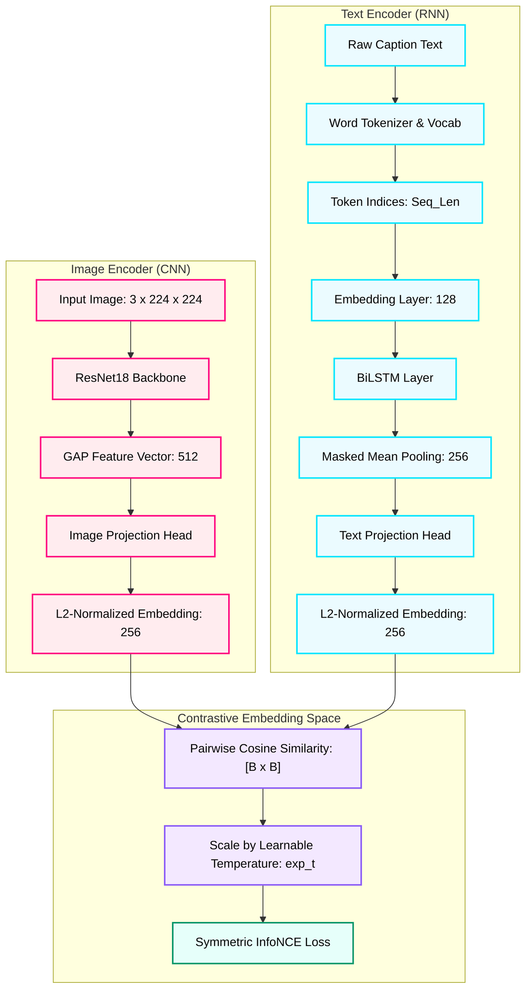
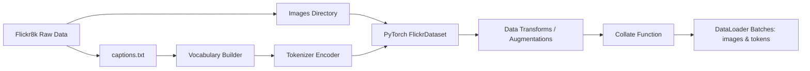
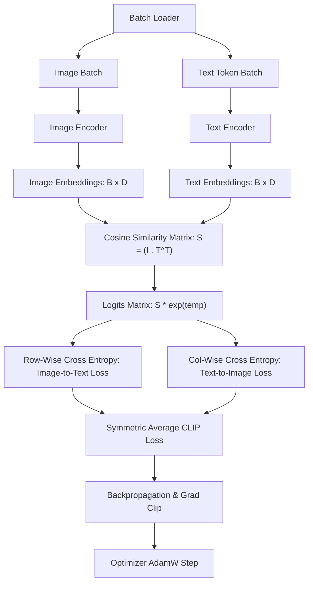
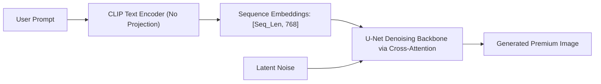

# CLIP From Scratch: PyTorch Educational Implementation

This repository contains a clean, production-quality, fully documented implementation of **Contrastive Language-Image Pretraining (CLIP)** built from scratch in PyTorch. 

This is an **educational and research-focused implementation**, designed to prioritize visual excellence, readability, and a deep mathematical understanding of multimodal contrastive learning without relying on external pretrained models (such as OpenAI's or HuggingFace's CLIP).

---

## 📐 Architecture Diagrams

### 1. General System Architecture


### 2. Data Processing & Pipeline Flow


### 3. Training & Contrastive Optimization Flow


---

## 📁 Directory & File Walkthrough

### 1. `data/`

#### 📄 [vocabulary.py](data/vocabulary.py)
*   **Why it exists**: Natural language words cannot be fed directly into an LSTM. This file builds a local string-to-integer dictionary based on caption frequencies, providing standardized indexes for model ingestion.
*   **Input**: Raw list of tokenized caption lists `List[List[str]]` during vocab construction.
*   **Output**: Mapped token dictionary, mapping vocabulary words to integers and vice versa. It handles four specific special tokens: `<pad>` (index 0), `<unk>` (index 1), `<start>` (index 2), and `<end>` (index 3).
*   **Mathematical Intuition**: Vocabulary building maps a discrete word token space $\mathcal{V}$ to a sequence of coordinate integers $\{0, 1, \dots, |\mathcal{V}|-1\}$.

#### 📄 [tokenizer.py](data/tokenizer.py)
*   **Why it exists**: Cleans text, splits sentences into individual words, adds boundary tokens, and converts them to fixed-length integer tensors.
*   **Input**: Raw string text `str`.
*   **Output**: Padded/truncated list of token indices `List[int]` of shape `[max_seq_len]`.
*   **Mathematical Intuition**: Truncates sequence length $S$ to a maximum boundary length $L$. Converts caption $C$ to:
    $$[idx(\text{<start>}), idx(w_1), \dots, idx(w_{L-2}), idx(\text{<end>})]$$

#### 📄 [dataset.py](data/dataset.py)
*   **Why it exists**: Interfaces with the local image folder and caption list, applying standard image augmentations and compiling clean batches.
*   **Input**: Indices of training items.
*   **Output**: A dictionary containing:
    *   `"image"`: Tensor of shape `[B, 3, 224, 224]`
    *   `"caption"`: Tensor of shape `[B, max_seq_len]`
    *   `"raw_caption"`: List of strings
    *   `"image_name"`: List of strings
*   **Design Choices**: Image augmentations include random cropping and horizontal flips during training to enforce invariance, forcing CLIP to align semantics rather than spatial positions.

---

### 2. `models/`

#### 📄 [projection_head.py](models/projection_head.py)
*   **Why it exists**: Raw feature outputs from the image (ResNet18, 512-dim) and text (BiLSTM, 256-dim) backbones have different sizes. The projection head maps both to a shared $d$-dimensional space (256-dim) where they can be compared directly.
*   **Input**: Encoder representation of shape `[B, in_features]`.
*   **Output**: Latent embedding of shape `[B, projection_dim]`.
*   **Mathematical Intuition**: An MLP with layer normalization and non-linear activation:
    $$z = \text{LayerNorm}(\text{Linear}_2(\text{GELU}(\text{LayerNorm}(\text{Linear}_1(x)))) + \text{Residual}(x))$$

#### 📄 [image_encoder.py](models/image_encoder.py)
*   **Why it exists**: Encodes the visual features of input images.
*   **Input**: Image batch tensor of shape `[B, 3, 224, 224]`.
*   **Output**: Normalized embedding of shape `[B, projection_dim]`.
*   **Mathematical Intuition**: Visual features are extracted, global average pooled, projected, and L2-normalized:
    $$\hat{v}_i = \frac{g(v_i)}{\|g(v_i)\|_2}$$
    where $g$ represents the ResNet backbone and projection head.

#### 📄 [text_encoder.py](models/text_encoder.py)
*   **Why it exists**: Encodes natural language caption structures.
*   **Input**: Integer token tensor of shape `[B, max_seq_len]`.
*   **Output**: Normalized embedding of shape `[B, projection_dim]`.
*   **Design Choices**: Implements a bidirectional LSTM (BiLSTM) and performs **Masked Mean Pooling** over non-pad tokens to capture accurate contextual sentences.
*   **Mathematical Intuition**:
    $$\hat{t}_j = \frac{h(t_j)}{\|h(t_j)\|_2}$$

#### 📄 [clip_model.py](models/clip_model.py)
*   **Why it exists**: Integrates both encoders and hosts the learnable log-temperature parameter for logit scaling.
*   **Input**: Images `[B, 3, 224, 224]` and Text tokens `[B, max_seq_len]`.
*   **Output**: Normalized image and text embeddings, and the current scaling temperature $\tau$.

---

### 3. `losses/`

#### 📄 [contrastive_loss.py](losses/contrastive_loss.py)
*   **Why it exists**: Core CLIP loss objective. Measures alignment between positive matches while penalizing negative alignments.
*   **Input**: Normalized image embeddings $I \in \mathbb{R}^{B \times D}$, normalized text embeddings $T \in \mathbb{R}^{B \times D}$, and temperature $\tau$.
*   **Output**: Symmetric InfoNCE loss scalar.
*   **Mathematical Intuition**: Detailed in the mathematics section below.

---

### 4. `training/` & `retrieval/` & `visualization/`

*   **`metrics.py`**: Computes validation Recall@1, Recall@5, and Recall@10 across the entire evaluation set.
*   **`engine.py`**: Handles batched forward passes, backward passes, gradient clipping, and full-evaluation cross-modal gatherings.
*   **`train.py`**: Coordinates pretraining, handles dynamic vocabulary building, saves checkpoints, and logs metrics.
*   **`image_retrieval.py`** & **`text_retrieval.py`**: Pre-computes embedding indices to run interactive Text-to-Image and Image-to-Text retrieval queries.
*   **`tsne_embeddings.py`**: Extracts shared space embeddings and generates gorgeous dark-themed t-SNE and UMAP visualizations, complete with connection links highlighting pulled pairs.

---

## 📊 Mathematics of CLIP

### 1. Embeddings & Shared Latent Space
Images and text are encoded into raw vectors. Once projected into the shared latent space, they are L2-normalized:
$$\hat{i}_k = \frac{i_k}{\|i_k\|_2}, \quad \hat{t}_k = \frac{t_k}{\|t_k\|_2}$$

Because both embeddings reside on a unit hypersphere, the cosine similarity between an image $k$ and text $l$ simplifies to their dot product:
$$\cos(\theta) = \frac{\hat{i}_k \cdot \hat{t}_l}{\|\hat{i}_k\|_2 \|\hat{t}_l\|_2} = \hat{i}_k \cdot \hat{t}_l^T$$

### 2. Similarity Matrix & Scaled Logits
Given a batch of size $B$, we compute the pairwise similarity matrix $M \in \mathbb{R}^{B \times B}$. To control the scale of logits fed to softmax (controlling classification sharpness), we multiply by a learnable temperature factor $e^\tau$:
$$S_{k, l} = e^\tau \left( \hat{i}_k \cdot \hat{t}_l^T \right)$$

### 3. Symmetric Loss Formulation
The objective maximizes the diagonal values $S_{k, k}$ while minimizing off-diagonal distractors. This is achieved symmetrically:
1.  **Image-to-Text Loss (Row-wise Categorical Cross-Entropy)**:
    $$\mathcal{L}_{i2t} = -\frac{1}{B} \sum_{k=1}^B \log \frac{e^{S_{k, k}}}{\sum_{l=1}^B e^{S_{k, l}}}$$
2.  **Text-to-Image Loss (Column-wise Categorical Cross-Entropy)**:
    $$\mathcal{L}_{t2i} = -\frac{1}{B} \sum_{l=1}^B \log \frac{e^{S_{l, l}}}{\sum_{k=1}^B e^{S_{k, l}}}$$

The final joint objective is:
$$\mathcal{L}_{CLIP} = \frac{\mathcal{L}_{i2t} + \mathcal{L}_{t2i}}{2}$$

---

## 💡 Why Contrastive Learning Works

### 1. Contrastive Learning vs. Standard Classification
In standard image classification, a model projects images to a fixed set of discrete class labels (e.g. 1000 ImageNet categories) using a Softmax classifier. This suffers from:
*   **Closed-world assumption**: The model cannot categorize classes outside its predefined training list.
*   **Static semantic gap**: The representations are forced into hard discrete boundaries, missing the rich descriptive details of natural language (e.g., distinguishing "a golden retriever catching a yellow frisbee in a forest" from just "dog").

**Contrastive Pretraining** resolves this by replacing discrete class labels with a continuous text representation. Instead of matching images to a fixed index, CLIP matches images to captions. Because natural language can describe anything, CLIP learns a **generalizable open-vocabulary space**, enabling it to perform zero-shot classification on completely unseen categories.

### 2. Connection to Diffusion Models
Modern Text-to-Image diffusion models (such as **Stable Diffusion**) require a mechanism to understand natural language prompts and guide the noise-denoising generation process. CLIP serves as this crucial bridge:



1.  **Semantic Guidance**: The CLIP text encoder generates normalized token-level embeddings representing the user's prompt.
2.  **Cross-Attention Injection**: These text representations are injected into the U-Net or Transformer denoising network of the diffusion model through cross-attention mechanisms.
3.  **Shared-Space Matching**: Because CLIP was pretrained to align visual semantic concepts with language descriptions, the diffusion model can query these representations to guide random visual noise step-by-step until the generated image perfectly matches the caption.

---

## 🚀 Running the Project

### 🖥️ Google Colab Quickstart (Recommended)
Running CLIP on Google Colab provides free high-performance GPU access and bypasses local physical RAM and Windows paging-file size limitations.

1. **Clone the Repository**:
   Open a new [Google Colab](https://colab.research.google.com/) notebook. Clone the repository into a folder named `clip_from_scratch` (this folder name is required so that Python's absolute module imports resolve correctly):
   ```bash
   !git clone https://github.com/Vansh17555555/clip-rebuilt.git clip_from_scratch
   ```

2. **Navigate into the Project Root**:
   In a new code cell, change directories to step into the cloned project:
   ```bash
   %cd clip_from_scratch
   ```

3. **Download & Prepare Flickr8k Dataset**:
   To acquire Flickr8k automatically using the Kaggle API in your Colab session:
   * Upload your `kaggle.json` API token (from Kaggle Account settings) into Colab's file directory.
   * Run the following block in a code cell to download and extract the dataset:
   ```bash
   !pip install -q kaggle
   !mkdir -p ~/.kaggle
   !cp kaggle.json ~/.kaggle/
   !chmod 600 ~/.kaggle/kaggle.json
   
   # Download Flickr8k dataset zip and extract
   !kaggle datasets download -d adityajn105/flickr8k
   !mkdir -p data/flickr8k
   !unzip -q flickr8k.zip -d data/flickr8k
   ```

4. **Verify Paths in `configs/config.yaml`**:
   Double-click `configs/config.yaml` in the Colab file browser and ensure the paths point to the Colab content directory:
   ```yaml
   dataset:
     image_dir: "/content/clip_from_scratch/data/flickr8k/Images"
     caption_file: "/content/clip_from_scratch/data/flickr8k/captions.txt"
     # Make sure training checkpoint dir is also set
     checkpoint_dir: "/content/clip_from_scratch/checkpoints"
   ```

5. **Run Sanity Check & Pretraining**:
   To verify imports, forward passes, and launch the GPU training loop, execute:
   ```bash
   # Run sanity check
   !python -m run_sanity_checks
   
   # Start pretraining
   !python -m training.train
   ```

6. **Interactive Retrieval Demos**:
   Once training checkpoints are saved in `/content/clip_from_scratch/checkpoints/`, run retrieval searches:
   ```bash
   !python -m retrieval.image_retrieval
   ```

---

### 💻 Local Run Commands (Standard OS)

### 1. Pretraining CLIP
To run the pretraining loop on your configured parameters:
```bash
python -m training.train
```

### 2. Running Cross-Modal Retrieval
To test the Text-to-Image or Image-to-Text retrieval systems once a checkpoint has been saved:
```bash
python -m retrieval.image_retrieval
python -m retrieval.text_retrieval
```

### 3. Visualizing Latent Space
To extract embeddings and generate a premium-grade dark visualization chart of the shared latent space:
```bash
python -m visualization.tsne_embeddings
```
